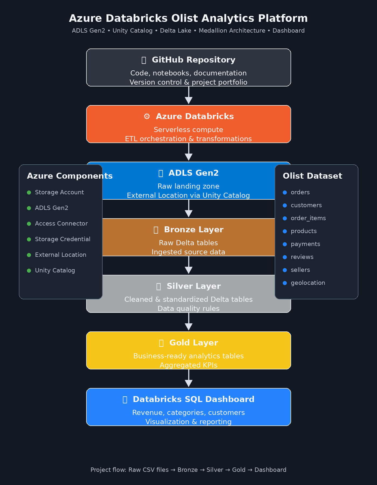
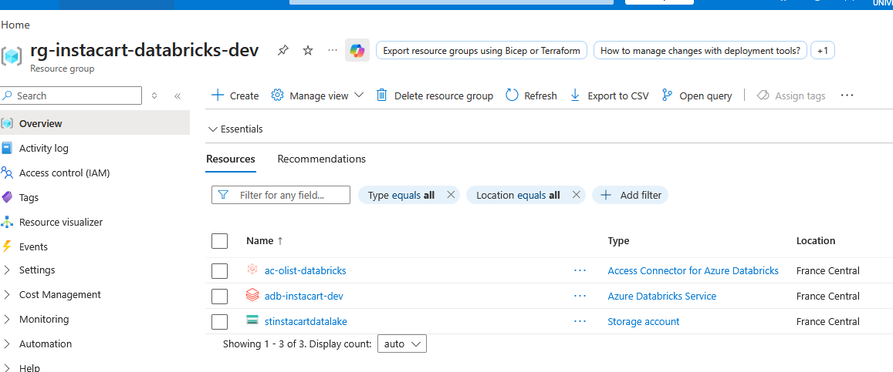
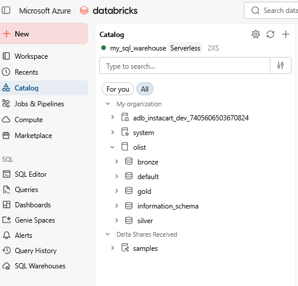
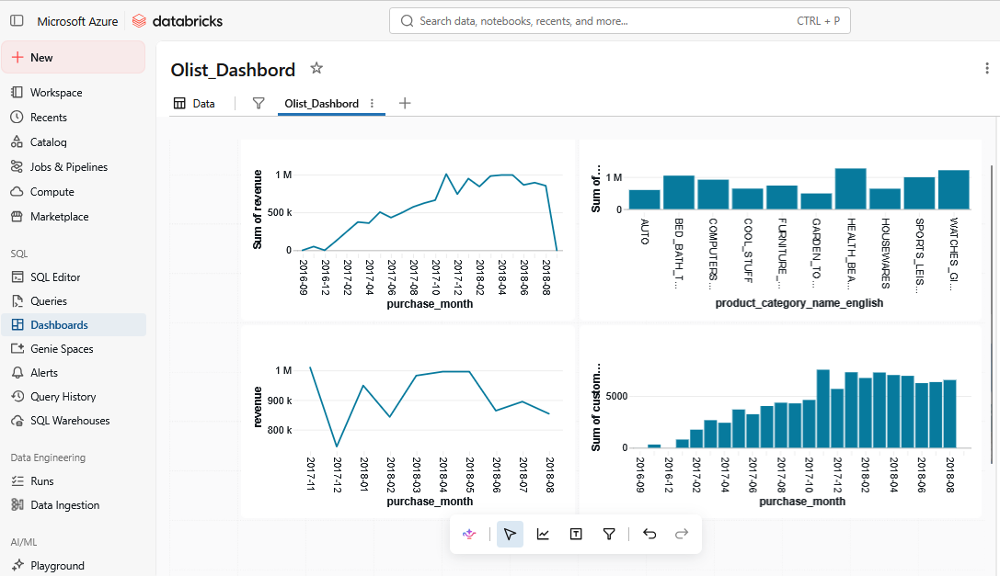

# Azure Databricks Olist Analytics Platform

## Overview

This project demonstrates the implementation of a complete Lakehouse architecture on Azure using Azure Databricks, ADLS Gen2, Unity Catalog and Delta Lake.

The solution ingests raw e-commerce data from the Brazilian Olist dataset, applies data quality rules through a Medallion Architecture (Bronze, Silver, Gold), and exposes business-ready analytics through Databricks SQL Dashboards.

---

## Architecture



### Technology Stack

* Azure Databricks (Serverless)
* Azure Data Lake Storage Gen2
* Unity Catalog
* Delta Lake
* Databricks SQL
* GitHub

---

## Azure Infrastructure



Resource Group:

```text
rg-instacart-databricks-dev
```

Resources:

* Azure Databricks Workspace
* Azure Data Lake Storage Gen2
* Azure Databricks Access Connector

---

## Unity Catalog



Catalog:

```text
olist
```

Schemas:

```text
bronze
silver
gold
```

---

## Dataset

Source:

Brazilian E-Commerce Public Dataset by Olist

Main entities:

* orders
* customers
* products
* order_items
* payments
* reviews
* sellers
* geolocation
* category_translation

---

## Medallion Architecture

### Bronze Layer

Raw CSV files are ingested from ADLS Gen2 and stored as Delta Tables.

Tables:

* bronze.orders
* bronze.customers
* bronze.products
* bronze.order_items
* bronze.payments
* bronze.reviews
* bronze.sellers
* bronze.geolocation
* bronze.category_translation

### Silver Layer

Data quality and cleansing rules are applied:

* Null handling
* Deduplication
* Business validations
* Standardization
* Data enrichment

Tables:

* silver.orders
* silver.customers
* silver.products
* silver.order_items
* silver.payments
* silver.reviews
* silver.sellers
* silver.category_translation

### Gold Layer

Business-oriented analytics tables.

Main table:

```text
gold.sales_analytics
```

Metrics:

* Total Revenue
* Total Orders
* Total Customers
* Total Products
* Freight Cost
* Average Item Price

---

## Dashboard



Implemented KPIs:

### Revenue by Month

Monthly revenue evolution.

### Top Categories

Revenue generated by product category.

### Customer Activity

Customer evolution by month.

### Sales Analytics

Business performance metrics.

---

## Data Volumes

| Table       |      Rows |
| ----------- | --------: |
| Orders      |    99,441 |
| Customers   |    99,441 |
| Products    |    32,951 |
| Order Items |   112,650 |
| Payments    |   103,886 |
| Reviews     |    98,410 |
| Sellers     |     3,095 |
| Geolocation | 1,000,163 |

---

## Project Structure

```text
azure-databricks-olist-analytics/

├── notebooks/
│   ├── 01_bronze_ingestion.py
│   ├── 02_silver_transformation_orders.py
│   ├── 02_silver_transformation_customers.py
│   ├── 02_silver_transformation_products.py
│   ├── 02_silver_transformation_items.py
│   ├── 02_silver_transformation_payments.py
│   ├── 02_silver_transformation_review.py
│   ├── 02_silver_transformation_seller.py
│   ├── 02_silver_transformation_category_translation.py
│   └── 03_gold_sales_analytics.py
│
├── images/
│   ├── architecture.png
│   ├── azure_resources.png
│   ├── unity_catalog.png
│   └── dashboard.png
│
└── README.md
```

---

## Skills Demonstrated

### Azure

* Azure Databricks
* ADLS Gen2
* Access Connector
* Unity Catalog
* Storage Credentials
* External Locations

### Data Engineering

* Delta Lake
* ETL Development
* Medallion Architecture
* Data Quality
* Data Modeling
* Data Transformation

### Analytics

* SQL Analytics
* KPI Design
* Dashboarding

---

## Future Improvements

* Auto Loader
* Delta Live Tables
* Incremental Processing
* CI/CD with GitHub Actions
* Automated Data Quality Monitoring

---

## Author

Data Engineering Portfolio Project built with Azure Databricks and Azure Data Lake Storage Gen2.

